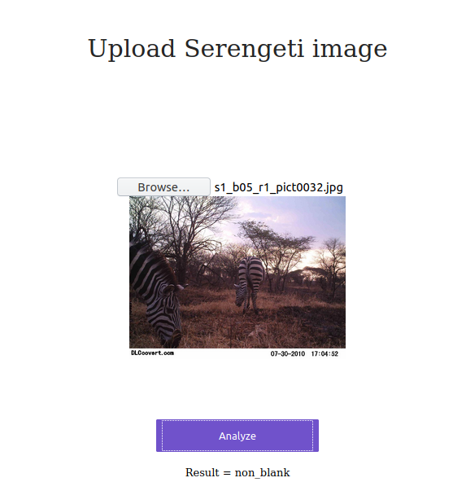

# Serengeti_deployment

The repository contains an app code, which allows to **upload single image** from Serengeti Dataset and **predict** if the image is *blank* (no animals visible) or *non-blank* (animals visible on the picture). It's a proof of concept model, which aim to exclude *blank* images, which bring no information regarding animal behaviour research. In my [blog post](https://sylwiamielnicka.com/blog/image-data-exploration-serengeti-dataset/) you can find more about **data exploration**. I described the process of training model in the [Kaggle notebook](https://www.kaggle.com/sylwiamielnicka/camera-trap-image-identifier-pytorch-cyclicallr). [Another repository](https://github.com/SylwiaOliwia2/Serengeti_AWS_Prediction) stores the code which **predicts set of** (Serengeti) **images** uploaded to AWS S3. The GUI appearance comes form **Fast.AI** [lesson 2](https://course.fast.ai/videos/?lesson=2), but was adjusted for PyTorch + Flask.



# Deployment (AWS EC2)

1. Create **AWS EC2 instance** (setup instruction here, from [Hosting the docker container on an AWS ec2 instance](https://towardsdatascience.com/simple-way-to-deploy-machine-learning-models-to-cloud-fd58b771fdcf#fd93)). The instance should be set up with the following features available:
    - **Ubuntu Server 18.04 LTS** (HVM), SSD Volume Type
    - **t2.medium** or **t3.medium** (or any other with at least 3 GiB memory)
    - **public DNS** automatically set up when the instance is started (in the Step 3 of launching machine choose *Enable* in *Auto-assign Public IP* field)
    - **HTTP** traffic on port **80**
2. Create AWS EC2 **Key Pair** and save in your computer (also in the [instruction](https://towardsdatascience.com/simple-way-to-deploy-machine-learning-models-to-cloud-fd58b771fdcf#fd93)).
3. Clone the repo:
    ```
    git clone https://github.com/SylwiaOliwia2/Serengeti_deployment.git
    ````
4. Start the EC2 instance.
5. SSH to it using Public DNS and saved Permission Key: 
    ```
    ssh -i </home/your-permission-key-location.pem> ubuntu@<your-public-DNS>
    ```
6. In the AWS console (the one that you ssh'aged to):
    ```
    mkdir deploy_folder
    mkdir deploy_folder/static
    mkdir deploy_folder/templates
    ```
7. Open new console and copy files from your machine to the AWS instance (replace the angle bracket strings with proper values): 
    ```
    scp -i </home/your-permission-key-location.pem> * ubuntu@<your-public-DNS>:/home/ubuntu/deploy_folder 
    scp -i </home/your-permission-key-location.pem> static/* ubuntu@<your-public-DNS>:/home/ubuntu/deploy_folder/static 
    scp -i </home/your-permission-key-location.pem> templates/* ubuntu@<your-public-DNS>:/home/ubuntu/deploy_folder/templates
    ```
    If the Dockerfile will be located directly in `/home/ubuntu` (instead of *deploy_folder*), the Docker will copy all the files in `/home` including preinstalled libraries and environments which is useless and takes ages.
8. Install Docker:
    ```
    sudo apt-get install docker.io
    ```
9. In the AWS console: 
    ```
    sudo docker build -t app-serengeti . 
    ```
10. In the AWS console: 
    ```
    sudo docker run -p 80:5000 app-serengeti . 
    ```
    The console shoud say that the app is running on *0.0.0.5000*.
11. In the browser open your **public DNS** link. It should display the app. Click *Predict* button. The predicted label should be displayed below.
12. Close the app and turn the machine off. 

In the folder `/images` you can find example images.
